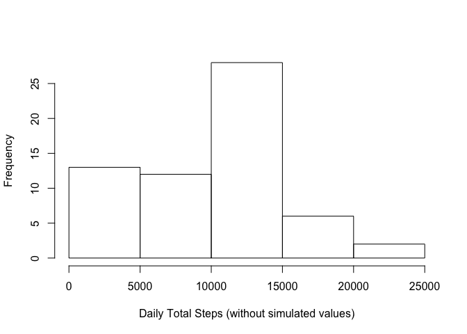
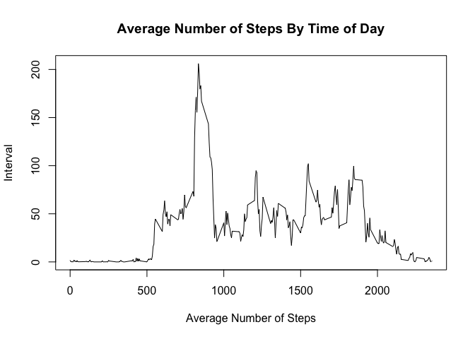
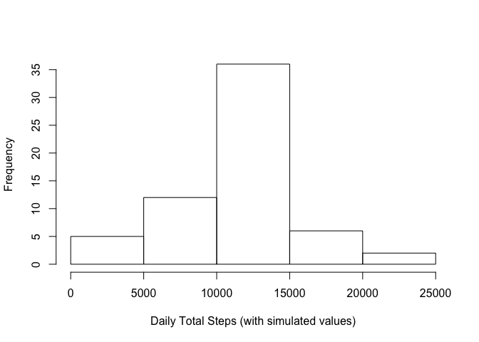
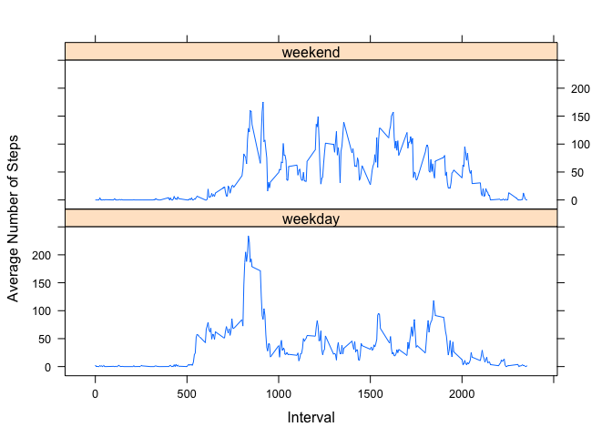

# Reproducible Research: Peer Assessment 1

The data for this project were obtained by forking the git repository here: [GitHub repository created for this
assignment](http://github.com/rdpeng/RepData_PeerAssessment1). The forked repository was then cloned in the current working directory.

## Loading and preprocessing the data

The data were unzipped and read in to a data frame, ignoring NA's.


```r
unzip("activity.zip")
activity<-read.csv("activity.csv",na.strings="NA")
```

## What is the mean total number of steps taken per day?

I calculated the total number of steps by day, and plotted the result in a histogram. I then found the mean and median of the total number of steps taken per day.


```r
totStepsByDay<-aggregate(activity$steps,by=list(activity$date),FUN=sum,na.rm=TRUE)
hist(totStepsByDay$x,xlab="Daily Total Steps (without simulated values)", main="")
```

 

```r
meanStepsPerDay<-mean(totStepsByDay$x)
medianStepsPerDay<-median(totStepsByDay$x)
```

The mean number of steps per day is 9354 and the median number of steps per day is 10395.

## What is the average daily activity pattern?

To compute a time series of the average number of steps across all days by the 5-minute interval, I again used the aggregate function, shown below. The resulting time series is shown in the plot below.


```r
timeOfDaySteps<-aggregate(activity$steps,by=list(activity$interval),FUN=mean,na.rm=TRUE)
plot(timeOfDaySteps$Group.1,timeOfDaySteps$x,type="l",xlab="Average Number of Steps", ylab="Interval",main="Average Number of Steps By Time of Day")
```

 

Next I found the interval containing the maximum average number of steps.


```r
maxInt<-timeOfDaySteps$Group.1[timeOfDaySteps$x==max(timeOfDaySteps$x)]
```

The 5-minute interval of the day with the highest average number of steps is 835.

## Imputing missing values

With the code below, I found the total number of missing values in the original "activity" data set.


```r
numMiss<-sum(is.na(activity$steps))
```

The total number of missing valuse in the original data set is 2304.

To reduce the effect of missing values on the data analysis, I created a copy of the original data set, and imputed missing values by replacing "NA"s with the average number of steps according to the time of day, as computed above. This method was chosen because number of steps is expected to be more highly correlated with time of day, rather than the total by the date. Using the average by time of day is also more robust that using a daily sum, because some days have no valid values for "steps". 


```r
activityImpute<-activity
for (i in 1:length(activityImpute$steps)) {
  if (is.na(activityImpute$steps[i])) {
    activityImpute$steps[i]<-timeOfDaySteps$x[timeOfDaySteps$Group.1==activityImpute$interval[i]]
  }
}
```

I then computed total steps by day for the new data frame, and plotted the results in a histogram. I also calculated the mean and median of the result.


```r
totStepsByDayImpute<-aggregate(activityImpute$steps,by=list(activityImpute$date),FUN=sum)
hist(totStepsByDayImpute$x,xlab="Daily Total Steps (with simulated values)", main="")
```

 

Next I found the mean and median of the daily total Steps.


```r
meanStepsByDayImpute<-mean(totStepsByDayImpute$x)
medianStepsByDayImpute<-median(totStepsByDayImpute$x)
```

The mean number of steps per day is 10766 and the median number of steps per day is 10766. Imputing the data set in this way brings the mean and the median in line with each other because we are replacing what is presumed to be a nearly random distribution of missing values with their equivalent means. Comparing to the non-imputed data set, we can see that the mean of the total steps per day is lower than the mean using the data set with simulated values. The median value of the original data was also lower as compared to the mean of the data set with simulated values, but not by as much; this is likely because the median is a more robust metric, as it's not influenced by outliers.

## Are there differences in activity patterns between weekdays and weekends?

To explore whether there are differences in activity patterns between weekdays and weekends, we first add a new column to the activityImpute data frame with the day of the week name. Then we use this name to decide whether to label the day as either a "weekday" or "weekend".


```r
activityImpute$weekday=weekdays(as.Date(activityImpute$date))
activityImpute$weekday[activityImpute$weekday=="Sunday"|activityImpute$weekday=="Saturday"]<-"weekend"
activityImpute$weekday[activityImpute$weekday!="weekend"]<-"weekday"
activityImpute$weekday<-as.factor(activityImpute$weekday)
```

I found the average number of steps per day for weekdays and weekends separately, and made a two-paneled plot, comparing activity for each type of day.


```r
library(lattice)
timeOfDayWeekdaySteps<-aggregate(activity$steps,by=list(activityImpute$weekday,activityImpute$interval),FUN=mean,na.rm=TRUE)
xyplot(timeOfDayWeekdaySteps$x ~ timeOfDayWeekdaySteps$Group.2 | timeOfDayWeekdaySteps$Group.1, layout=c(1,2),type="l",xlab="Interval",ylab="Average Number of Steps")
```

 

From the plots above, it appears that, on weekdays, activity levels rise from their base level early than on weekends. Activity levels on weekdays are highest in the morning, and low during the daytime hours. On weekend days, activity levels tend to be a little higher in the mornings compared to the remainder of the day, the sharp contrast between elevated morning activity and lower daytime activity is not seen so much on the weekend so much as the weekdays. Activity levels tend to stay more elevated throughout the daytime hours on weekends, as compared to weekdays. It also appears that activity levels die down earlier in the day on weekdays than they do on weekends.
